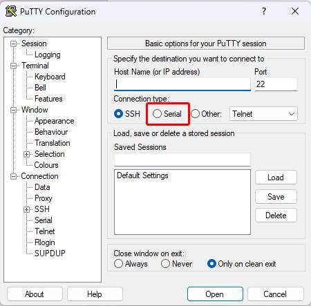
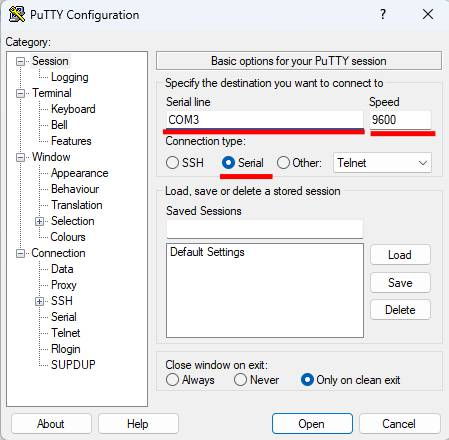
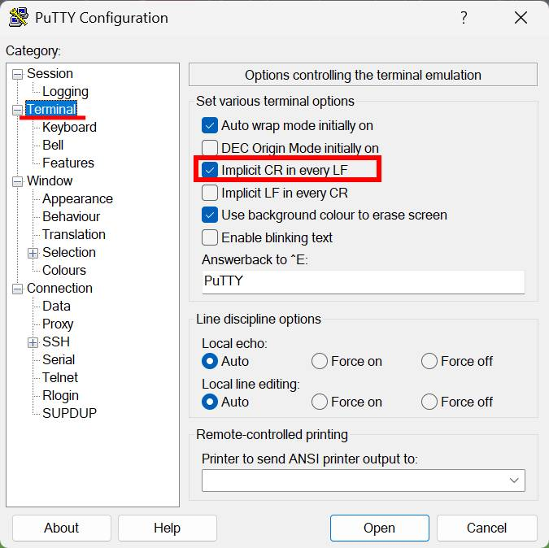
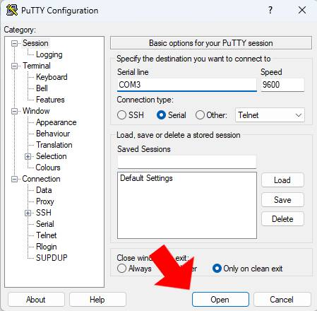

# Tutorial de AVR-GCC en el Atmega328p #
El motivo del repositorio era practicar la programación en C en microcontroladores. Por disponibilidad, se ha
utilizado una placa Arduino UNO R3, que contiene un microcontrolador Atmega328p. En las siguientes cabeceras
se mostrarán los periféricos programados con sus respectivos circuitos, además de unos incisos y consejos
al principio.

## Documentación ##
Se han usado los documentos oficiales de la placa Arduino UNO R3 y el datasheet oficial del Atmega328p. También el uso de
Chat GPT ha sido de ayuda, **no para generar código** sino para alguna explicación sobre el funcionamiento del dispositivo
que ha sido difícil de entender con la documentación ya mencionada. Además, sitios web como StackOverflow han sido de ayuda.
Aquí están los enlaces a los datasheets:
* [Arduino UNO R3](https://docs.arduino.cc/hardware/uno-rev3/?_gl=1*ngoux9*_up*MQ..*_ga*MjEzMzE0NDM4Ny4xNzU3ODQyMTA2*_ga_NEXN8H46L5*czE3NTc4NDIxMDMkbzEkZzEkdDE3NTc4NDIxMTMkajUwJGwwJGg4NjQwMDUyMzM.)<br>

* [Atmega328p](https://ww1.microchip.com/downloads/aemDocuments/documents/MCU08/ProductDocuments/DataSheets/Atmel-7810-Automotive-Microcontrollers-ATmega328P_Datasheet.pdf)

## Inciso y software de terceros ##
Cada carpeta contiene un código `.c`, con su respectivo script para compilarlo y pasarlo a la placa tanto para GNU/Linux
como para Windows. Los siguientes pasos a realizar son los mismos en los sistemas operativos mencionados previamente:<br>
**Requisitos previos**<br>
> Es necesario tener accesible desde la terminal el compilador **AVR-GCC** y el programa encargado de la transmisión **AVRDUDE**.<br>

**Compilación y transmisión**<br>
> Entra al directorio correspondiente y en la terminal escribe:
```
make
```

**Comunicación serie**<br>
Hay una carpeta, cuyo nombre es `usart`, en la que se encuentran prácticas del puerto serie. El archivo `usart.c`
trata de transmitir una cadena de caracteres constantemente, mientras que `usart_read.c` de leer datos enviados por
el ordenador. Para poder comunicarse por el puerto serie USB desde el PC, se requiere del programa PuTTY en Windows
y el programa `source` en GNU/Linux. Se explicarán los pasos necesarios para poder establecer la comunicación para
cada sistema operativo.<br>

* **Windows**: Primero se ejecuta PuTTY y se selecciona la comunicación `serie`(*figura1*). Después, habrá que rellenar el campo
`speed`(*figura2*), que es la velocidad de la transmisión en baudios. Para los programas desarrollados, está establecido es de 9600
baudios(*figura2*). También es necesario elegir que puerto: `COM1`, `COM2`, `COM3`, …, `COMN`. Para eso, hay que rellenar el campo
`Serial line`(*figura2*). Cabe mencionar que en caso de que el ordenador reciba del puerto el carácter `\n` y lo pueda imprimir de
forma correcta, hace falta acceder al campo `Terminal` y marcar la opción `Implicit CR in every LF`(*figura3*). Por último, se presiona el
botón de `open`(*figura4*).<br>


|:--:|
|Figura 1|


|:--:|
|Figura 2|


|:--:|
|Figura 3|


|:--:|
|Figura 4|

* **GNU/Linux**:<br>

> También se puede utilizar el IDE de Arduino para comunicarse con la placa.

### Enlaces de descarga ###
* [AVR-GCC](https://www.microchip.com/en-us/tools-resources/develop/microchip-studio/gcc-compilers)
* [avrdude](https://github.com/avrdudes/avrdude/releases)
* [PuTTY](https://www.chiark.greenend.org.uk/~sgtatham/putty/latest.html)
* [Arduino IDE](https://www.arduino.cc/en/software/)

## Prácticas ##
### Puertos de salida ###
Se trata de aprender a usar los puertos de salida, conectando un led en dicho puerto, tal y como se muestra en la *figura 4*.
El código se encuentra en la carpeta `led`.

|:--:|
|Figura 4|

> Este circuito **también se va a utilizar** en el directorio **Timer**.

### Timer ###
Este trata de aprender a manejar el Timer 0 del microcontrolador. Para ello, la luz del led cambia su
intensidad (de encendido a apagado y de apagado a encendido) cada 5 segundos.

### PWM ###
Se vuelve a utilizar el timer0, pero esta vez en su modo PWM. Así, el valor que se le asigne en el registro OCR0A
se refleja en la intensidad de la luz del led conectado al puerto 6 y el puerto 5 (pines OC0A y OC0B respectivamente)
en función del registro OCR0B. A continuación se mostrará su circuito en la *figura 5*.


|:--:|
|Figura 5|

### USART ###
Como se ha mencionado antes, hay dos prácticas del uso del puerto serie en el Atmega328p. Por un lado, `usart.c`
consiste en enviar la cadena de caracteres "4k\n" de forma constante. Por ello, no se ha utilizado ningún
puerto ni requiere de ningún circuito para que pueda funcionar.<br>

Por otro lado, en el código de `usart_read.c` el PC manda por comunicación serie un carácter por teclado. Entonces,
la placa lee el dato recibido y, si dicho valor se encuentra dentro del rango cerrado y acotado [2, 4], activará el
pin con el correspondiente número. En caso contrario, se desactivará. Para poder ver qué pin se ha activado, se ha
conectado una bombilla led a cada pin2, pin3 y pin4. En la *figura 6* se mostrará dicho circuito.

|:--:|
|Figura 6|

### ADC ###
La forma que se obtiene un valor analógico es mediante un divisor de voltaje, tal y como se muestra en la *figura 7*. 
El programa trata de una máquina de tres estados. Antes de hablar de los estados, hay que aclarar que se inicializan
los periféricos y que el adc comienza la conversión al empezar el programa.<br>
Dicho esto, en el primer estado, se espera  a que el ADC haya terminado; en ese caso se cambia del siguiente estado.
Además, se le cambia de orden al número obtenido, porque el usart va a transferir el número de dígito en dígito desde
el más pequeño. En cuanto a periféricos, el adc se apaga y se enciende el puerto serie.<br>
En el segundo, se envía el dato recibido por el conversor mediante el periférico USART0 al ordenador. En el momento que
no queden más cifras por enviar, se transferirá el carácter `\n`, para imprimir en pantalla una nueva línea e indicar el
final del mensaje. Además, se cambia al tercer estado, que se encarga de esperar a que el carácter ya mencionado haya
llegado al PC, para así poder encender de nuevo el adc, apagar el puerto serie y empezar desde 0, cambiando de nuevo al
primer estado.


|:--:|
|Figura 7|
